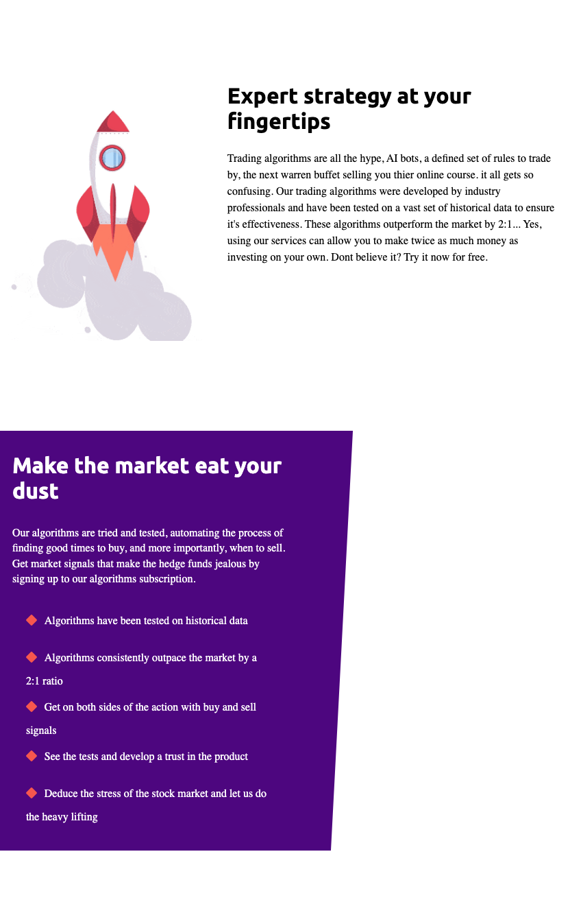
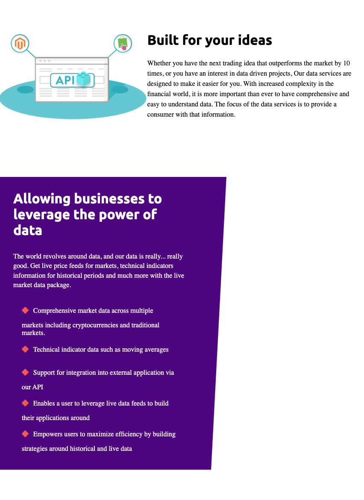
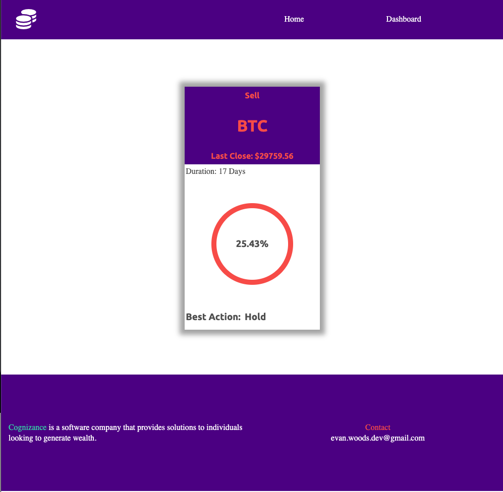

# Congnizance


## License

[](https://opensource.org/licenses/MIT)

https://opensource.org/licenses/MIT


## Table of Contents
* [Description](#description) 
* [Future Developments](#futuredevelopments)
* [Technologies](#technologies)
* [Installation Instructions](#installation)
* [Usage Instructions](#usage)
* [Contribution Guide](#contribute)
* [Tests](#tests)
* [Questions](#questions)


## Description
This is my final project for The University of Sydney's "Full Stack Flex Coding Bootcamp". 

The project is called Congnizance and it is a financial services application that uses algorithms to recomend whether a user should buy or sell a given stock or cryptocurrency.

The MVP of this project involves a limmited amount of recomendations due to the restrictions of the free tier on MongoDB Atlas. Currently, only Bitcoin is running on live data, but there are plans to increase that to the entire cryptocurrency market, and expand into traditional markets such as securities and commodities.

The trading algorithm used was backtested in development and was found to return 2 times the underlying asset. That is, if a stock returns 20% in one year, the algorithm will on average return 40%. When tested on bitcoin, the highest return seen accross a 4 year period was 1600%, again, double that of the cryptocurreny itself.

Upon launching the app, the user is presented with an information landing page, describing the business, and portals to view their options within our services.


If a user navigates to the portals at the bottom of the screen, they can read more about the app and its specific services.

 

When a user decides what service they would like to use, they can sign up for the app, which upon completing, will be presented with the dashboard. This dashboard shows the recomendations of the algorithm and allows users to take inspiration and become their own hedge fund.





## Future Developments
The app is still a work in progress and only meets MVP requirements. Improvements will continue to be integrated into the app over the coming weeks and months. These improvements are as follows:
* Increase data offerings.
* Add the api side of the application to allow other developers to build their own solutions.
* Add a subscription service to allow users to access the data.
* Add a messaging service to notifty users on their mobile of an update from the algorithm (telling them to buy or sell something).

## Technologies
* React
* CSS
* Node js
* Express
* Python
* MongoDb Atlas


## Installation
To Install and run this application yourself, follow the below step(s).

```
npm i
```
Followed by:
```
npm run develop
```


## Usage
Once installed and running using the above commands, open the local app in your browser.

The app is deployed on Heroku and acceessable here: https://evan-woods-final-project.herokuapp.com/


## Contribute
This project is finished and requires no additional contributions


## Tests
This project does not include tests


## Questions
For any questions about the code please see my github for source code, email me at the address provided, or find my social media links on my portfolio website. 
* https://github.com/EvanCWoods
* evan.woods.dev@gmail.com
* https://evan-woods-updated-portfolio.herokuapp.com/
